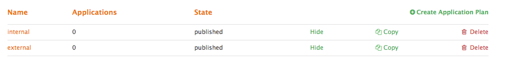
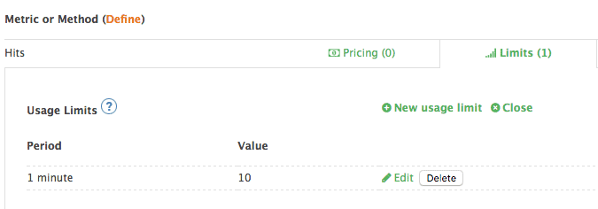

In this step, we're going to configure two different types of access for our different types of users, let's say internal and external developers.

The way to configure different types of access is by creating multiple **Application plans**.

## Task 1

You can create application plans using the CLI like this:
`3scale-cli app-plan create -p <name_of_app_plan> -s <service_id>`

Try creating a couple of application plans called *internal* and *external* respectively.

The application plans you just created should show as published in the UI.

## Task 2

Whereas we want to give internal developers full access to our API, we may want to limit the number of calls that the external developers can make.

We can achieve that by applying rate limits. To do so, visit your *Admin Portal > APIs > [your API] > Application plans* and click on the plan called **external**.

Find the **Hits** metric and click on *Limits* and then on *New usage limit*.

Apply any limits you want, for example, 10 calls per minute, and save. Don't forget to click on *Update Application plan* to save the changes.

With this, you have limited your external developers to make 10 calls per minute. You can also apply rate limits per method.

Ready to get some developers started with your API?
