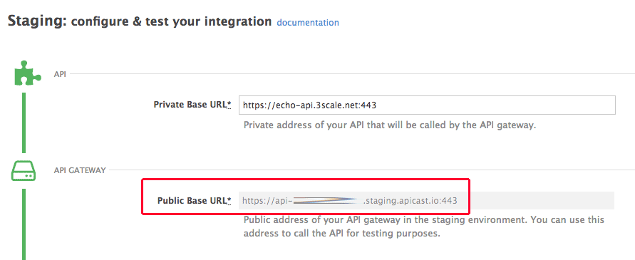

In this step we're going to create and publish interactive documentation. Then we're going to have Chris try it out!

## Task 1

You can easily create ActiveDocs - that's how the 3scale interactive documentation is called - by importing your API definition spec. To do so, run the following command:

`3scale-cli activedocs create -f ../assets/echo.json`{{execute}}

Go to *APIs > ActiveDocs* and see how the ActiveDocs have been created.

## Task 2

Next is to specify the proper host in our docs. Go find your staging public URL in *APIs > Integration*.

Copy the staging URL and paste it in your ActiveDocs: *APIs > ActiveDocs > [your doc] > Edit*:

`"host": "<your-staging-public-url>"`

Save the changes before moving to the next task.

## Task 3

Next we're going to publish this in our developer portal. 3scale comes with an out-of-the-box developer portal that you can fully customize. We're not going to do that now, but we're going to see how to publish the ActiveDocs.

Go to *Developer Portal*, search for a page called `Documentation` and click on it to edit:

Edit the following line of the code adding the system name of your ActiveDocs. You can find it in your terminal, it was printed when you created it:

``

Save and publish your changes.

## Task 4

We're ready to let Chris try the API.

Go to `https://commandline.3scale.net/` and login with Chris' credentials:

- *Username*: Chris
- *Password*: letmein

Now just try calling any of the endpoints and see how the API key is pre-populated with Chris' key given that he has access to the service. If everything went well, you should get a response from the Echo API.

And that's it! You've succesfully integrated an API with 3scale, created and published interactive documentation, and let your first user try it :-)